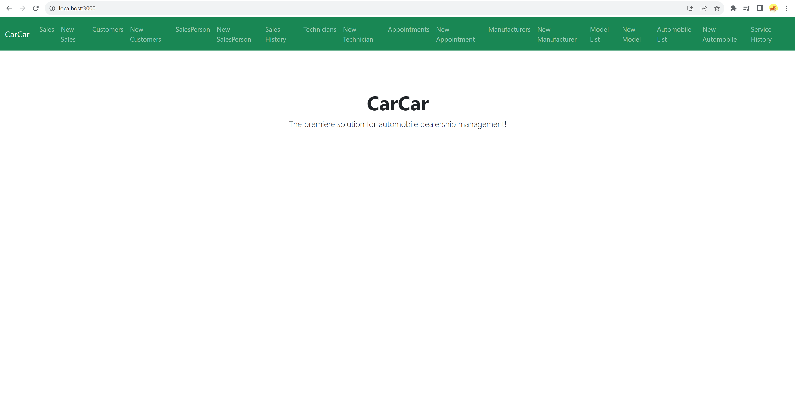
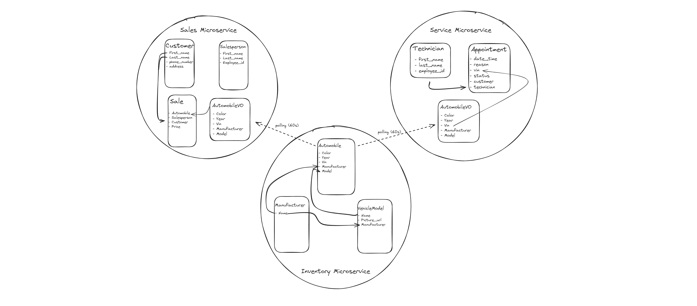

# CarCar

Team:

* John Gray - Service
* Chase Robles - Sales

## To get started working on the program
* First make sure you have docker installed and running.
* Secondly have a terminal open and its directory is set to the top level of this program(\project-beta).
* Lastly in your terminal run these commands.
    - docker volume create beta-data
    - docker-compose build
    - docker compose up
* Double check to make sure your container is running and after that you're good to start working on this project

## Design

;

## Ports & Urls

* Port (8100) Inventory
    - Get Lists
    - http://localhost:8100/api/automobiles/
        - POST
            {
            "color": "yellow",
            "year": 2018,
            "vin": "6K3CC5FB2AN135185",
            "model_id": {model.id}
            }
        - GET

    - http://localhost:8100/api/manufacturers/
        - POST
            {
            "name": "Chrysler"
            }
        - GET

    - http://localhost:8100/api/models/
        - POST
        {
        "name": "Sebring",
        "picture_url": "https://upload.wikimedia.org/wikipedia/commons/thumb/7/71/Chrysler_Sebring_front_20090302.jpg/320px-Chrysler_Sebring_front_20090302.jpg",
        "manufacturer_id": {manufacturer.id}
        }
        - GET

    - Get Details
    - http://localhost:8100/api/automobiles/{autos.vin}/
        - GET
        - PUT
            {
            "color": "yellow",
            "year": 2018,
            "vin": "8Y3CC5FG8AN135139",
            "model_id": {model.id}
            }
        - DELETE

    - http://localhost:8100/api/manufacturers/{manufacturers.id}/
        - GET
        - PUT
            {
            "name": "Chrysler2"
            }
        - DELETE

    - http://localhost:8100/api/models/{models.id}/
        - GET
        - PUT
        {
        "name": "Sebring2",
        "picture_url": "https://upload.wikimedia.org/wikipedia/commons/thumb/7/71/Chrysler_Sebring_front_20090302.jpg/320px-Chrysler_Sebring_front_20090302.jpg",
        "manufacturer_id": {manufacturer.id}
        }
        - DELETE

* Port (8090) Sales
    - Get List
    - http://localhost:8090/api/salesperson/
        - POST
            {
                "first_name": "Chase",
                "last_name": "Robles",
                "employee_id": "Crobles"
            }
        - GET

    - http://localhost:8090/api/customer/
        - POST
            {
                "first_name": "Logan",
                "last_name": "Short Guy",
                "address": "Middle of nowhere",
                "phone_number": "2815059959"
            }
        - GET

    - http://localhost:8090/api/sale/
        - POST
            {
                "automobile": "{autos.vin}",
                "salesperson": "{salesperson.id}",
                "customer": "{customer.id}",
                "price": "5800.26"
            }
        - GET

    - Get Details
    - http://localhost:8090/api/salesperson/{salesperson.id}/
        - GET
        - PUT
            {
                "first_name": "Chase2",
                "last_name": "Robles2",
                "employee_id": "Crobles2"
            }
        - DELETE

    - http://localhost:8090/api/customer/{customer.id}/
        - GET
        - PUT
            {
                "first_name": "Logan2",
                "last_name": "Short Guy2",
                "address": "Middle of nowhere2",
                "phone_number": "2815059952"
            }
        - DELETE

    - http://localhost:8090/api/sale/{sale.id}/
        - GET
        - PUT
            {
                "automobile": "{autos.vin}",
                "salesperson": "{salesperson.id}",
                "customer": "{customer.id}",
                "price": "5800.26"
            }
        - DELETE

## Sales microservice

The purpose of the sales microservice is to be able to make and list a customer, salesperson, sales, and to list sales made by a specific salesperson. A poller was used to pull information of automobiles so we could sell cars by thier 'vin' as long as it was in our database, and this was done through the SalesForm. The SalesForm takes in information from the customer, salesperson, and automobiles backend to populate the drop down selections in order to make a sale.

* Port (8080) Service

### Technician:
 ____________________________________________________________________________
|      Request      |   Method   |                    URL                    |
   List technicians |    GET     | http://localhost:8080/api/technicians/
|____________________________________________________________________________|

 ____________________________________________________________________________
|      Request      |   Method   |                    URL                    |
  Create technician |    POST    | http://localhost:8080/api/technicians/

  JSON Body:

    {
    "first_name": "Chase",
	"last_name": "Robles",
	"employee_id": "CRoblox97"
    }

|____________________________________________________________________________|

 ____________________________________________________________________________
|      Request      |   Method   |                  URL                      |
  Delete technician |   DELETE   | http://localhost:8080/api/technicians/:id/
|____________________________________________________________________________|

### Appointment:
 ___________________________________________________________________________________
|      Request       |   Method   |                    URL                          |
  List appointments  |    GET     | http://localhost:8080/api/appointments/
|___________________________________________________________________________________|

 ___________________________________________________________________________________
|       Request      |   Method   |                    URL                          |
  Create appointment |    POST    | http://localhost:8080/api/appointments/

  JSON Body:

    {
	"customer": "Vin Diesel",
	"vin" : "1C3CC5FB2AN120174",
	"technician" : 1,
	"reason" : "Needs new tires"
    }

|___________________________________________________________________________________|

 ___________________________________________________________________________________
|      Request         |    Method    |                  URL                        |
  Delete appointment   |    DELETE    | http://localhost:8080/api/appointments/:id/
|___________________________________________________________________________________|

 ____________________________________________________________________________________________
|      Request           |    Method    |                  URL                               |
  Set status 'cancelled' |     PUT      | http://localhost:8080/api/appointments/:id/cancel/
|____________________________________________________________________________________________|

 ____________________________________________________________________________________________
|      Request           |    Method    |                  URL                               |
  Set status 'finished'  |     PUT      | http://localhost:8080/api/appointments/:id/finish/
|____________________________________________________________________________________________|

## Service API * Port (8080) project-beta-service-api

Explain your models and integration with the inventory
microservice, here.

This microservice contains three models: Technician, Appointment and Automobile VO.

This API gives the capability to get a list of instances of the Technician class, create
an instance of the Technician class, and delete an instance of the Technician class.

The same cababilities are available with regard to the Appointment class. Additionally,
there are views to set the status attribute of Appointment to 'finished' or 'cancelled'.

AutomobileVO is a value object. Its attributes are updated by a poller every sixty seconds to
reflect the current attributes of the Automobile object in the Inventory API. This allows
the Appointment API to access update vin information.
